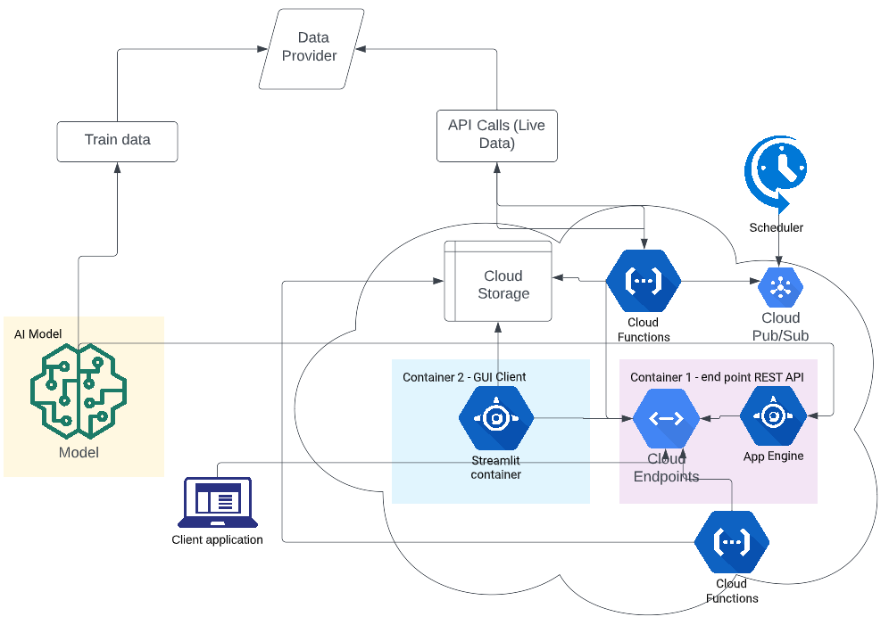

# Probability of recession model
----

**Summary**

This is the implementation of a probability of recession model. Some great work on this subject has been done by Terrence Zhang in the following [medium article](https://medium.com/towards-data-science/recession-prediction-using-machine-learning-de6eee16ca94). This repository productionalizes and automates this model in the google cloud platform.  

The easiest way to interact with the model is through the front end. The front end can be found at the following link:

https://recession-ui-container-ejf7xshddq-uc.a.run.app/

It is implemented and deployed using `google cloud run` as a Docker container. More on the implementation later.

**Screen shoot**

 

## Application components

The application was designed and developed using the microservices model. It consists of the following components that more or less function independently of each other:

* `ETL` - is implemented as a cloud function. Based on a daily schedule ETL process connects to the data provider (FRED, yahoo) daily and performs `ETL` operations to pull in the most up to date data
* `model` - model is developed using python data science stack with scikit-learn. This is static content and it does not use updates as others do.
* `endpoint` - deployed as an app engine flask application. It is designed as an endpoint to return a JSON response to a client request. 
* `front-end` - front-end is just one way to interact with the model (other being curl, python, etc). Its main job is to connect to the predictions datasets and displays the model results

* `score` - Score is an event-driven google cloud function that predicts probabilities of recession whenever the new data is available. It responds to an event of new data being saved in the google cloud storage bucket.  
 
**Design**

 

## Deployment

Deployed of all the components is preferable in the following order

* ETL:

ETL is deployed as a cloud function(s) in google cloud. Find more details about the deployment of this function [here](https://github.com/enisbe/capstone/tree/main/src/cloudfunction_etl) 

* Model: 

The model is a static component. It is trained once and deployed as a cloud endpoint. How to reproduce the same model can be found in the following [notebook](https://github.com/enisbe/capstone/blob/main/notebooks/model.ipynb).

* Flask Endpoint:

Once the model is created the application can be deployed using [app-engine](https://github.com/enisbe/capstone/tree/main/flask) (a cloud run is also an option)
  
 * Score: 

The score is implemented as a cloud function. It is a cloud storage event drive and responds to new data being saved. The data is scored against the flask endpoint.

* front end GUI client:

This is a fully independent client and was developed as an example of how one could use the prediction data. It is not the only way to interact with data but it is the only one implemented. Another way one could request the model is using curl, python, or some other language.
